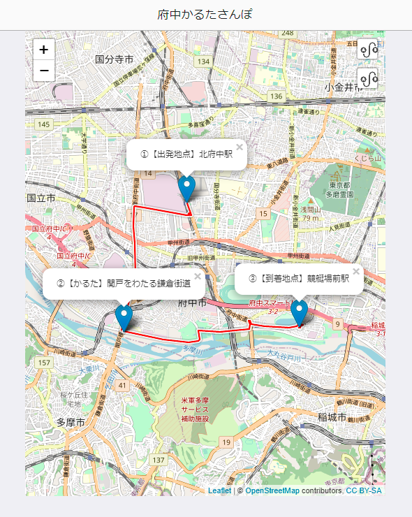

# karutaWalk (府中かるたさんぽ)

  

※地図出典: [©OpenStreetMap contributors](https://www.openstreetmap.org/copyright)

## 目的
* [Leaflet](https://leafletjs.com/)を使うとWebサイト上に地図を簡単に埋め込むことができることを知ったので、その習作として作ってみました。

## 概要
* 武蔵府中郷土かるたの標識設置場所をもとに散歩コースを生成し、マップ上に表示します。
  * 出発駅～かるた標識、かるた標識～到着駅の2つのルートを表示します。
* アプリケーションのバックエンド側は[Node.js(Express)](https://expressjs.com/ja/)、フロント側は[Bootstrap](https://getbootstrap.jp/)と[OnsenUI](https://ja.onsen.io/)で見た目を整えています。
* マップの表示は[Leaflet](https://leafletjs.com/)と[OpenStreetMap](https://www.openstreetmap.org/)、ルート検索は[Leaflet Routing Machine](https://www.liedman.net/leaflet-routing-machine/)を使用しています。

## 準備
* リポジトリの内容をcloneし、ルート上で下記コマンドを実行して必要なモジュールをインストールしてください。
```
$ npm install
```

* モジュールのバージョンがうまく合わず`npm start`実行時にエラーが発生する場合は、下記コマンドのほうが良いかもしれません。
```
$ npm ci
```

## 実行
* 下記コマンドをcloneしたリポジトリのルート上で実行し、[http://localhost:3000](http://localhost:3000)にアクセスするとページが表示されます。
```
$ npm start
```

## 使用データについて
* かるた読み札と標識設置場所の情報は、府中市が公開している下記オープンデータ(CC-BY)をもとにしています。
  * [武蔵府中郷土かるた読み札と標識設置場所一覧（平成29年1月23日現在）](https://www.city.fuchu.tokyo.jp/gyosei/fuchusinogaiyo/enkaku/kyodokaruta.files/musasihutyuukyoudokaruta2017.csv)
